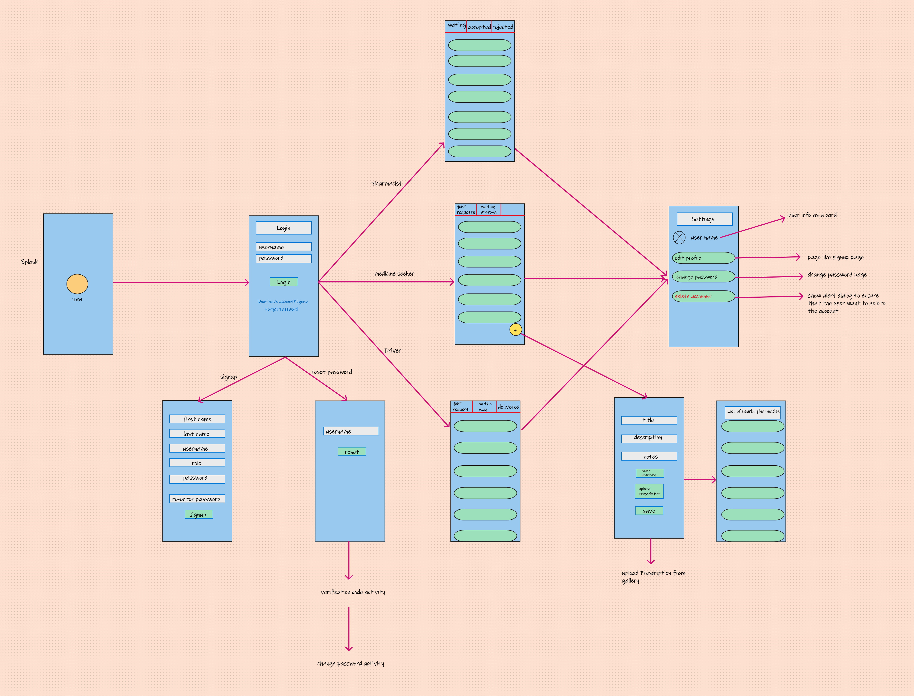

# Pharmacy Helper

## Team Members

#### 1. Mohammad Saqer(Team Leader).
#### 2. Mohammad Ghanem.
#### 3. Ahmad Khalili.
#### 4. Yousef Abu Qatrieh.
#### 5. Hashem Smadi.

## Team Agreement -> [here](ProjectReadMeFile/TeamAgreement.md)

## User stories

- As a drug buyer, I don't want to go to the pharmacy just to ask the pharmacist if I can take this drug with another type of drug so through the app I can know that easily.
- As a medicine buyer, I do not want to stand in crowded queues in pharmacies to buy medicine, so I want to order it through the application, so the medicine will come to my house without the need to go out.
- As a pharmacist, I need to sell medicines online in order to gain a wider customer base and add flexibility to my pharmacy, so I will use the application to sell medicines to a wider segment of customers.
- As a driver I need to increase my income, so I will work on this application to deliver medicines from the pharmacy to the patient.

### Feature Tasks:
- User can request the drug through the app.
- User can know Conflicts between medicines.
- Pharmacist can reply for the user request by if the drug founded or not and if yes he will reply by the price.
- User can accept the price or reject the request.
- If the user accept the pharmacist can send request to one driver to deliver the drug to user.

### Acceptance Tests:
- Ensure that the data is fetched correctly from the api.
- Ensure that the conflict between the drugs is shown correctly to the user.
- Ensure that the request is delivered correctly to the pharmacist from the user.
- Ensure that the reply is sent correctly to the user.
- Ensure that the request acceptable or unacceptable was gone to the pharmacist.
- Ensure that the order is out from the pharmacist to the driver.
- Ensure that the driver is received the request to deliver the drug. 

## Project Wireframe

## Software Requirements -> [here](ProjectReadMeFile/requirements.md)

